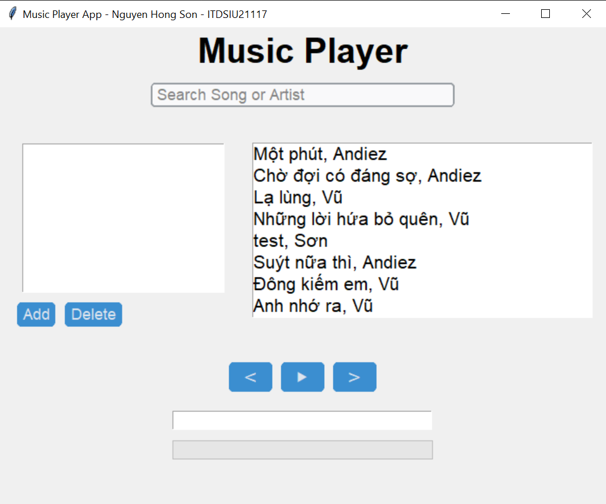
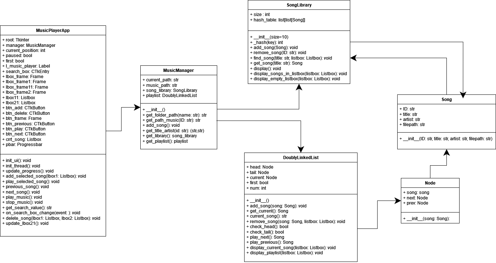

# DSA Music Player
# Nguyen Hong Son - ITDSIU21117
## Overview
This project is a music player application developed as part of the "Algorithms and Data Structures" course at Vietnam National University – HCM, International University, School of Computer Science and Engineering, Semester 2, 2023 - 2024.

## Table of Contents
1. [Introduction](#introduction)
   - [Motivation](#motivation)
   - [Technologies](#technologies)
   - [Launch](#launch)
2. [Project Details](#project-details)
   - [Rules](#rules)
   - [Design](#design)
   - [Others](#others)
3. [Data Structures and Algorithms Application](#data-structures-and-algorithms-application)
   - [Hash Table](#hash-table)
   - [Doubly Linked List](#doubly-linked-list)
4. [Conclusion](#conclusion)
5. [References](#references)

## Introduction

### Motivation
Developing a music player app offers the opportunity to combine technical skills with a passion for music, aiming to improve user experience through an intuitive, feature-rich, and personalized application. The project also serves as a learning experience in software engineering, multimedia integration, and potentially audio processing and machine learning.

### Technologies
- **Language**: Python
- **Libraries**:
  - Tkinter
  - Customtkinter
  - Threading
  - Time
  - Pygame
  - MP3
  - OS

### Launch
To run the application, execute the following code file: .\Final\Final_UI.py

## Project Details

### Rules
#### Objective
1. Add your favorite music from the song library and click the play button (“▶”). The first music in the playlist will be played. The current song will be illustrated at the bottom of the function buttons (next, play, previous). The progress bar will show the song's progress.
2. After the current song finishes, the next song in the playlist will be played. The application stops if there is no next song. Adding a new song after stopping will resume the current song, followed by the new song.

#### Setup
To add a new song to the library:
1. Add the song file in the format `title-artist.mp3` to the “Music” folder.
2. Access the `get_title_artist` method of the `MusicManager` class in the `Final_Manager.py` file.
3. Add the artist and title in the format `title-artist`.

#### General Controls
- **Search**: Type letters or words of the title or artist; results will be shown in the song library.
- **Add**: Add the song from the song library to the playlist.
- **Delete**: Delete the selected song from the playlist or library.
- **▶**: Play or pause the current song.
- **<**: Play the previous song; does not respond if on the first song.
- **>**: Play the next song; does not respond if on the last song.
- **Process Bar**: Illustrates the current song's progress.
- **List Box**: Shows the title and artist of the current song.

### Design
The user interface is designed to be basic yet functional, allowing users to manage and play their music easily.

### Others
The project includes a UML diagram to outline the structure and interactions within the application.

## Data Structures and Algorithms Application

### Hash Table
#### Purpose
The hash table is used in the `SongLibrary` class to efficiently manage songs by quickly adding, retrieving, and removing them.

### Implementation Details
### Hash Method
- **Purpose**: Generates a hash value for a song ID, mapping it to an index within the hash table.
- **Average Case Time Complexity**: O(1)
- **Worst Case Time Complexity**: O(1)

### Add Song Method
- **Purpose**: Adds a new song to the hash table.
- **Average Case Time Complexity**: O(1)
- **Worst Case Time Complexity**: O(n)

### Remove Song Method
- **Purpose**: Removes a song from the hash table by ID.
- **Average Case Time Complexity**: O(1)
- **Worst Case Time Complexity**: O(n)

### Find Song Method
- **Purpose**: Finds songs matching a title or artist and displays results.
- **Average Case Time Complexity**: O(m + k)
- **Worst Case Time Complexity**: O(m * n + k)

### Get Song Method
- **Purpose**: Finds and returns a song matching a title or artist.
- **Average Case Time Complexity**: O(m + k)
- **Worst Case Time Complexity**: O(m * n + k)

### Display Songs in Listbox Method
- **Purpose**: Populates a Tkinter Listbox widget with song titles and artists.
- **Average Case Time Complexity**: O(n + m + log(k))
- **Worst Case Time Complexity**: O(n * m + log(k))

### Display Empty Listbox Method
- **Purpose**: Displays an empty Listbox widget.
- **Average Case Time Complexity**: O(n + log(k))
- **Worst Case Time Complexity**: O(n + log(k))

### Doubly Linked List
The playlist manager supports operations such as adding, removing, and navigating through songs. The `DoublyLinkedList` allows for efficient forward and backward traversal of the playlist, making it suitable for music player applications.
### Implementation Details

#### Add Song Method
- **Purpose**: Adds a new song to the hash table.
- **Average Case Time Complexity**: O(1).
- **Worst Case Time Complexity**: O(n).

#### Remove Song Method
- **Purpose**: Removes a song from the hash table by ID.
- **Average Case Time Complexity**: O(1).
- **Worst Case Time Complexity**: O(n).

#### Find Song Method
- **Purpose**: Finds songs matching a title or artist and displays results.
- **Average Case Time Complexity**: O(m + k).
- **Worst Case Time Complexity**: O(m * n + k).

#### Get Song Method
- **Purpose**: Finds and returns a song matching a title or artist.
- **Average Case Time Complexity**: O(m + k).
- **Worst Case Time Complexity**: O(m * n + k).

#### Display Songs in Listbox Method
- **Purpose**: Populates a Tkinter Listbox widget with song titles and artists.
- **Average Case Time Complexity**: O(n + m + log(k)).
- **Worst Case Time Complexity**: O(n * m + log(k)).

#### Display Empty Listbox Method
- **Purpose**: Displays an empty Listbox widget.
- **Time Complexity**: O(n + log(k)).

## Conclusion
### Achieved Goals
1. Implement a library feature to store multiple songs in a sequence.
2. Implement a playlist feature to store and play multiple songs in a 
sequence.
3. Implement a progress bar to indicate the current song's progress in real-time.
4. Implement a feature to handle the end of a song and automatically play 
the next song in the playlist.
5. Implement a feature to pause, play, and skip songs.
6. Implement a feature to add and delete songs from the playlist or library.
7. Implement a feature to display the current song's information, the 
playlist, the song library.
8. Implement a search feature to search for songs or artists by name.
9. Implement a feature to display and update the search results real-time.

### Limitations
1. The application does not include any user authentication or authorization 
mechanisms.
2. The application does not include any support for playing songs from 
different formats or streaming songs from online sources.
3. The application does not include any support for managing playlists or 
saving the current playlist to a file.
4. The application does not include any support for managing user 
preferences or settings.
5. The application does not include any support for managing song 
metadata, such as album art or song lyrics.
6. The application does not include any support for managing song ratings 
or reviews.
7. The application does not include any support for managing song genres 
or categories.
8. The application does not include any support for managing song playlists 
or creating playlists based on user preferences or song attributes.
9. The application does not include any support for managing song 
recommendations or suggesting similar songs based on user preferences 
or song attributes.

### Future Enhancements
1. Implement a feature to shuffle the playlist
2. Implement a feature to repeat a single song
3. Implement a feature to display song lyrics
4. Implement a feature to display album artwork
5. Implement a feature to display song ratings and reviews
6. Implement a feature to display song recommendations based on the user's 
   listening habits or preferences and user listening history.

## References
1. Custom Tkinter Widgets. (n.d.). Retrieved June 22, 2024, from 
https://customtkinter.tomschimansky.com/
2. GeeksforGeeks. (n.d.). Doubly Linked List in Python. Retrieved June 22, 2024, from 
https://www.geeksforgeeks.org/doubly-linked-list-in-python/
3. GeeksforGeeks. (n.d.). Implementation of Hash Table in Python using Separate 
Chaining. Retrieved June 22, 2024, from
https://www.geeksforgeeks.org/implementation-of-hash-table-in-python-using-separate-chaining/
4. Psikka. (n.d.). GitHub - psikka/projects-yt: MusicPlayer. GitHub. Retrieved June 22, 
2024, from https://github.com/achudnova/projects-yt/tree/main/MusicPlayer
5. Psikka. (n.d.). YouTube - Psikka: ChatGPT Implementation. Retrieved June 22, 2024, 
from https://www.youtube.com/watch?v=RqNgCgu5Vw8
## Repository
[GitHub Repository](https://github.com/Son-SDT/DSA-Music_Player)

